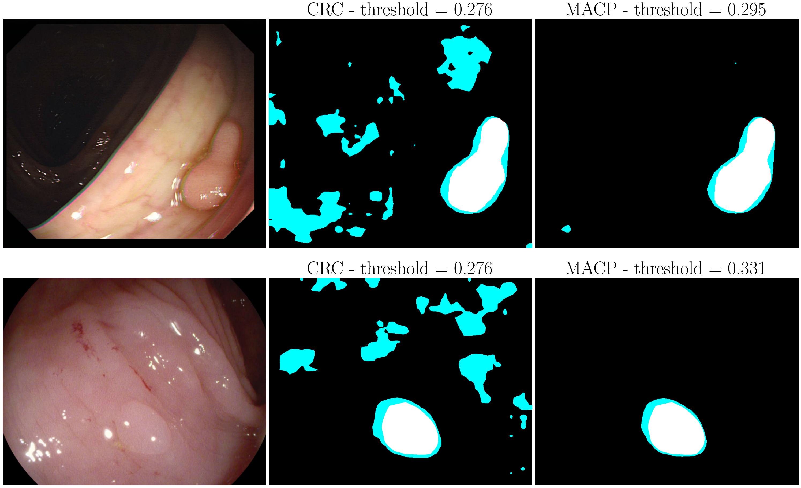

Automatically Adaptive Conformal Prediction
===============

This is the official repository of "Automatically Adaptive Conformal Prediction".



📊 Datasets
===============

We used two datasets for our experiments: Polyp Dataset ([train dataset](https://drive.google.com/file/d/1Y2z7FD5p5y31vkZwQQomXFRB0HutHyao/view?usp=sharing) and [test dataset](https://drive.google.com/file/d/1YiGHLw4iTvKdvbT6MgwO9zcCv8zJ_Bnb/view?usp=sharing)) and the [Fire segmentation dataset](https://www.kaggle.com/datasets/diversisai/fire-segmentation-image-dataset)


👨‍🍳 Prepare data
===============

In order to run our different algorithms, data are expected to be stored as follow:

    ├── ...
    └── data
       ├── polyp                 
       │   ├── train
       |   |   ├──   images
       |   |   └──   labels
       │   ├── val
       |   |   ├──   images
       |   |   └──   labels
       │   ├── res
       |   |   ├──   images
       |   |   └──   labels
       │   ├── cal
       |   |   ├──   images
       |   |   └──   labels
       │   └── test
       |       ├──   images
       |       └──   labels
       └── fire
           ├── train
           |   ├──   images
           |   └──   labels
           ├── ...
           
           └── test
               ├──   images
               └──   labels

🏃‍♀️Train model
===============

The architecture as well as the trained weights for the PraNet model can be found [here](https://github.com/DengPingFan/PraNet). So here we only need to train a UNet for the fire segmentation

```bash
$ python multiaccurate_cp/main.py train --ml-data-dir=data/fire/02_prepared_data --output-dir=data/fire/03_model_weights/unet
```


🔮 Semantic segmentation inference
===============

For each model, the inference has to be run on the residual, calibration and test datasets

### UNet inference
```bash
$ python multiaccurate_cp/main.py infer-unet --model-dir=data/fire/03_model_weights/unet --model-name=$MODEL_NAME --data-dir=data/fire/02_prepared_data --ml-set=$ML_SET --output-dir=data/fire/04_predictions/
```

### PraNet inference

```bash
$ python multiaccurate_cp/main.py infer-polyp --data-dir=data/polyp/02_prepared_data --output-dir=data/polyp/04_predictions/ --model-dir=data/polyp/03_model_weights/pranet ml-set=$ML_SET
```

📌 Train embedding model
===============

```bash
$ python multiaccurate_cp/main.py train-residual --ml-data-dir=data/$DATASET/02_prepared_data --probas-dir=data/$DATASET/04_predictions --output-dir=data/$DATASET/03_model_weights/resnet --model.resnet=resnet50 --model.model-input=image_and_probas --model.embedding-size=1024
```

📥 Inference residual
===============
```bash
$ python multiaccurate_cp/main.py infer-residual --model-dir=data/$DATASET/03_model_weights/resnet --model-name=$MODEL_NAME --data-dir=data/$DATASET/02_prepared_data --pred-proba-dir=data/$DATASET/04_predictions --ml-set=$ML_SET
```

## Test data
```
$ python multiaccurate_cp/main.py infer-residual --model-dir=data/aerial/03_model_weights/resnet --model-name=20240322_1039 --data-dir=data/aerial/02_prepared_data --pred-proba-dir=data/aerial/04_predictions --ml-set=test
```

# Inference PraNet
```
$ python multiaccurate_cp/main.py infer-polyp --data-dir=data/polyp/02_prepared_data --output-dir=data/polyp/04_predictions/ --model-dir=data/polyp/03_model_weights/pranet ml-set=res
```

# Train residual for Polyps

```
$ python multiaccurate_cp/main.py train-residual --ml-data-dir=data/polyp/02_prepared_data --probas-dir=data/polyp/04_predictions --output-dir=data/polyp/03_model_weights/resnet --model.resnet=resnet50 --model.model-input=image_and_probas --model.embedding-size=1024 --polyp
```

# Inference residual polyp
## Calibration data
```
$ python multiaccurate_cp/main.py infer-residual --model-dir=data/polyp/03_model_weights/resnet --model-name=20240325_1057 --data-dir=data/polyp/02_prepared_data --pred-proba-dir=data/polyp/04_predictions --ml-set=cal
```

## Test data
```
$ python multiaccurate_cp/main.py infer-residual --model-dir=data/aerial/03_model_weights/resnet --model-name=20240325_1057 --data-dir=data/polyp/02_prepared_data --pred-proba-dir=data/polyp/04_predictions --ml-set=test
```